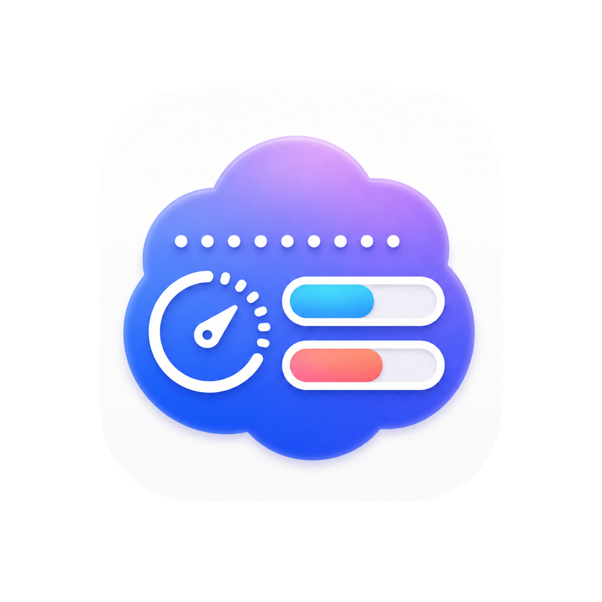
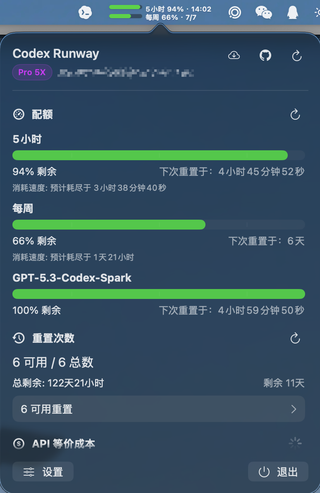
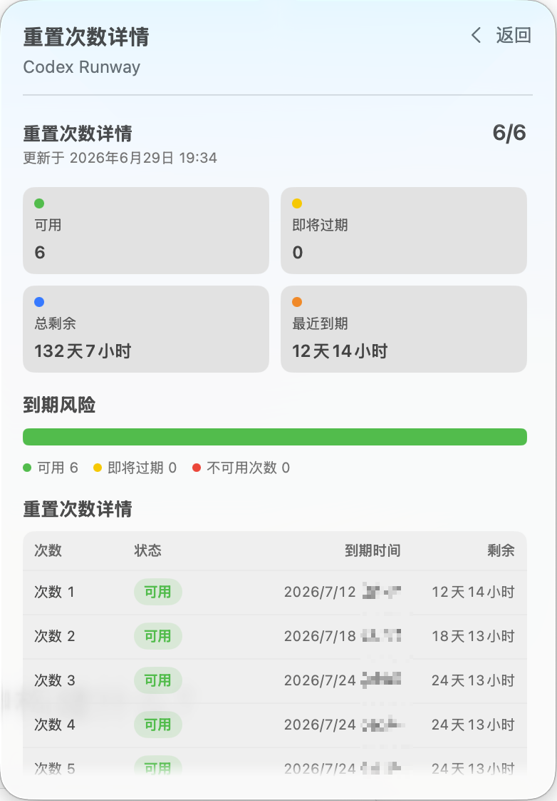
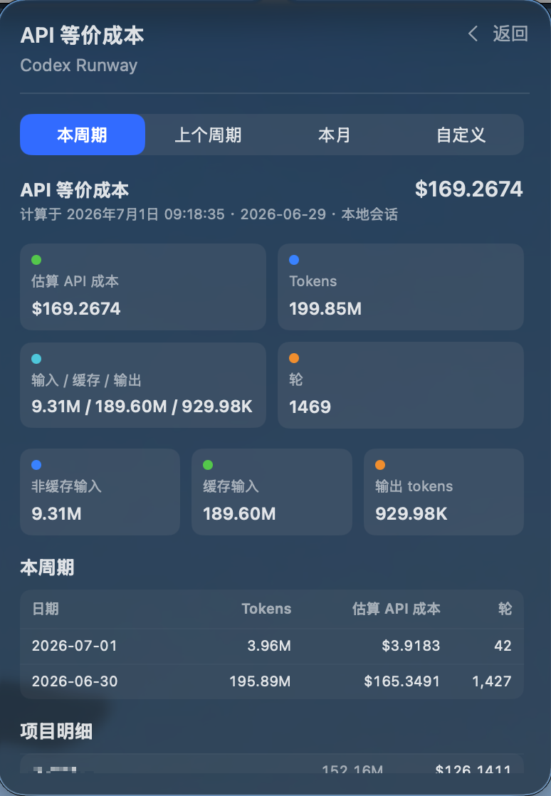

<p align="center">
  
</p>

# Codex Runway

[中文](README.md) | English

How much longer can your Codex keep running?

Codex Runway is a native macOS menu bar app that keeps Codex quota, reset credits, usage cost, and local session health visible at a glance. It is built for people who use Codex heavily and want fewer quota surprises during long work sessions.

## Highlights

- See remaining Codex runway directly in the menu bar.
- Track 5-hour, weekly, and additional quota pressure before it blocks work.
- Identify the active Codex account and subscription tier to avoid account confusion.
- Monitor reset credits and expiry risk so available resets are not wasted.
- Estimate API-equivalent cost for the current cycle to understand usage intensity.
- Repair local session index consistency when Codex session lists drift.
- Native macOS menu bar experience with light, dark, system appearance, Chinese, and English.
- Built-in update checks keep the app current.

## Screenshots

<p align="center">
  
  
  
</p>

## Installation

Download the matching zip from GitHub Releases:

- Apple Silicon: `CodexRunway-macos-arm64.zip`
- Intel: `CodexRunway-macos-x86_64.zip`

Unzip it and place `CodexRunway.app` in `Applications` or any folder you prefer.

### macOS Security Blocks

Current releases are ad-hoc signed and not notarized. If macOS says the developer cannot be verified or the app was not checked for malicious software, right-click `CodexRunway.app` and choose Open, or go to System Settings > Privacy & Security and click Open Anyway.

If macOS says `CodexRunway.app` is damaged and should be moved to the Trash, it is usually the download quarantine attribute. After placing the app in `Applications`, run:

```bash
xattr -dr com.apple.quarantine /Applications/CodexRunway.app
```

Then open the app again.

## Requirements

- macOS 12+
- A local Codex login
- `~/.codex/auth.json` exists on this Mac

## Run Locally

```bash
swift run CodexRunway
```

Self-check:

```bash
swift run CodexRunway --self-check
```

The self-check prints local diagnostics with tokens redacted.

## Privacy

- Tokens are read only from local `~/.codex/auth.json`.
- Access tokens, refresh tokens, and ID tokens must not be written to logs, README files, issue templates, or self-check output.
- API-equivalent cost is computed from local session JSONL logs by default and does not upload session contents.
- Online usage data is used only when local token data is unavailable.
- Session repair only touches `~/.codex/session_index.jsonl`, creates a backup before writing, and never deletes session files.
- Update checks request only version information. Codex account and session data are not uploaded.

## Development and Contribution

```bash
swift test
swift build
swift build -c release
```

See [CONTRIBUTORS.md](CONTRIBUTORS.md) for contribution notes.

## License

This project follows the repository [LICENSE](LICENSE).
