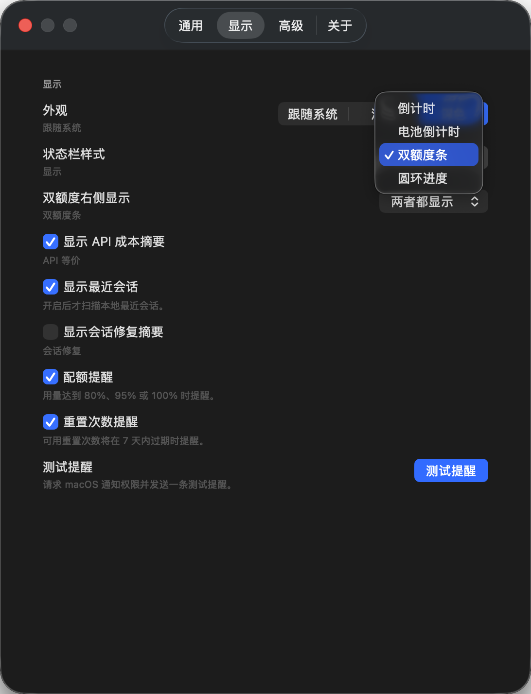
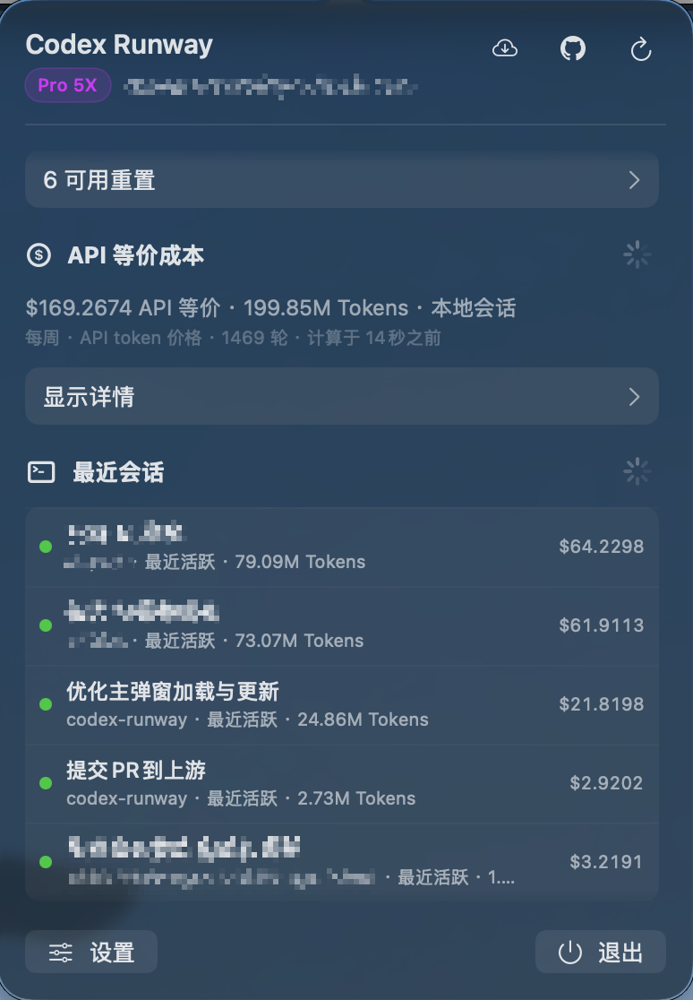

<p align="center">
  
</p>

# Codex Runway

[中文](README.md) | English

How much longer can your Codex keep running?

Codex Runway is a native macOS menu bar app for checking Codex quota, whether rate limits reset today, reset credits, API-equivalent cost, and local sessions, with multi-account management, safe account switching, and built-in update checks.

## Highlights

- Check remaining Codex quota from the menu bar.
- View 5-hour, weekly, and additional quota windows.
- See whether Codex rate limits have reset today from a public third-party status feed, with a countdown to the next reset window when available and a jump to the related post.
- Toggle the “reset today?” section in settings and configure its own refresh interval (on by default, every 1 hour).
- Manage multiple Codex accounts: browser sign-in, import local `auth.json`, paste token/JSON (including `/auth/session`), import files, or add an API key.
- Switch accounts safely after confirmation by atomically writing `~/.codex/auth.json`, with an optional Codex restart so CLI / IDE stay in sync.
- Show the current account, subscription tier, and expiration.
- View reset credit count, status, and expiration time.
- View API-equivalent cost and token usage for today, the current cycle, the previous cycle, this month, or a custom range; the default range is configurable in settings.
- Use a local incremental session index for faster cost scans.
- View recent Codex sessions, projects, status, and usage summaries.
- Repair the local session index.
- Support light, dark, system appearance, Chinese, and English.
- Support built-in update checks.

## Screenshots

<p align="center">
  
  
  
  
  
</p>

## Installation

Download the matching zip from GitHub Releases:

- Apple Silicon: `CodexRunway-macos-arm64.zip`
- Intel: `CodexRunway-macos-x86_64.zip`

Unzip it and place `CodexRunway.app` in `Applications` or any folder you prefer.

### macOS Security Blocks

Current releases are ad-hoc signed and not notarized. If macOS says the developer cannot be verified or the app was not checked for malicious software, right-click `CodexRunway.app` and choose Open, or go to System Settings > Privacy & Security and click Open Anyway.

If macOS says `CodexRunway.app` is damaged and should be moved to the Trash, it is usually the download quarantine attribute. After placing the app in `Applications`, run:

```bash
xattr -dr com.apple.quarantine /Applications/CodexRunway.app
```

Then open the app again.

## Requirements

- macOS 12+
- Codex installed and used on this Mac is recommended
- Import from local `~/.codex/auth.json`, or add accounts in the app (browser sign-in, paste credentials, import files, and more)

## Run Locally

```bash
swift run CodexRunway
```

Self-check:

```bash
swift run CodexRunway --self-check
```

The self-check prints local diagnostics with tokens redacted.

## Privacy

- Tokens are read from local `~/.codex/auth.json`; multi-account credentials are stored only under `~/.codex-runway/accounts/<id>/auth.json` (directory mode `0700`, file mode `0600`). The account index `index.json` never contains tokens.
- Official `~/.codex/auth.json` is overwritten only when you confirm an account switch (atomic write), so Codex CLI / IDE stay in sync.
- Refreshing a non-active managed account updates only its library copy, not official `auth.json`. Refreshing the active account keeps the official auth file and the library copy in sync.
- Invalid or mock credentials are never written back to official `~/.codex/auth.json`.
- Access tokens, refresh tokens, ID tokens, and API keys must not be written to logs, README files, issue templates, or self-check output.
- API-equivalent cost is computed from local session JSONL logs by default, with derived data such as a local incremental index under `~/.codex-runway/`. Session contents are not uploaded.
- Online usage data is used only when local token data is unavailable.
- Session repair only touches `~/.codex/session_index.jsonl`, creates a backup before writing, and never deletes session files.
- Update checks request only version information. Codex account and session data are not uploaded.

## Data sources

- **Reset today?**: Status comes from the public third-party site [hascodexratelimitreset.today](https://hascodexratelimitreset.today/) and its `api/status` endpoint. Codex Runway only fetches the published result and never attaches Codex accounts or tokens. Treat it as advisory — this app does not control or guarantee that source’s accuracy or availability.
- **Quota / reset credits / some online usage**: When you are signed in, requests use your local credentials against the official ChatGPT / Codex backend APIs.
- **API-equivalent cost and recent sessions**: Computed by default from local `~/.codex` session logs and the local index.

## Development and Contribution

```bash
swift test
swift build
swift build -c release
```

See [CONTRIBUTORS.md](CONTRIBUTORS.md) for contribution notes.

## License

This project follows the repository [LICENSE](LICENSE).
